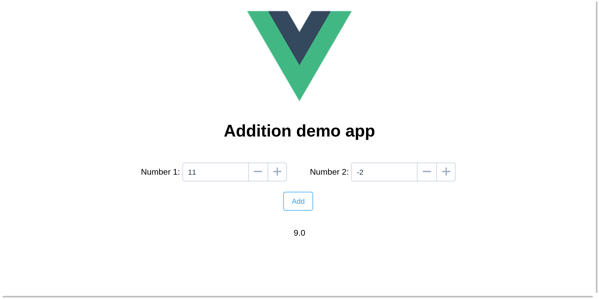

# addition-project
Send two numbers to a server with AJAX and display the response

This is a front end for my other [flask-with-vue-project](https://github.com/silverock/flask-with-vue-project)

Like that one it's part of my own hobby-learning, which I'm not very far at.

Although that server also has its own page where you can do something similar, this one is more for trying out element.

This is all it's supposed to do for now:

